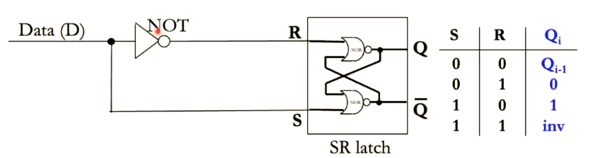

# Key points from lecture sides

★: Frequently asked in Exams

## BigPic-1

### Evolution of Computer

1945(By Von Neumann) - present: programs set up by plugging cables and setting switches --> programs store in computer's memory.

- (Electronic switches)Transistors number increase
- Transistors change from: vacuum tube -> discrete bipolar transistors -> Integrated Circuits
- Transistors cost decrease

### Moore's Law

***Basic***: the number of transistors on a chip doubles approximately every 2 years.

***Why slows down***:

- Physical limits of miniaturization
- Power limits of too many transistors switching
- Challenge of coverging transistors into performance
- Economic implication

### Types of Computer System

- Servers
- Personal Computers
- Mobile devices
- Embedded (Largest number)

### Computer Components

- Processor
  - Data Path
  - Control Path
- Memory
- I/O

### Computer System Stacks

From bottom to the top:
Hardware -> OS -> User applications

## Data-Representation-Int-2

P&H 5/e: 2.4, 3.1,3.2, 3.5

### The way in which data is represented in computer hardware affects

- complexity of circuits
- cost
- speed
- reliability

### Bit, Byte, Word

- ***Bit*** = Binary digiT
- ***Byte*** = 8 bits
- ***Word*** = 4 bytes = 32 bits
- ***Advantage***: simple circuits,  reliable
- ***Disadvantage***: need a lot of bit

### Two's complement

- Sign-magnitude representation is not good:
  - have two zero: +0 and -0
  - complicate addition and subtruction
- ***Basic*** : **Flip the bits and add 1**
- MSB is the sign ✔
- Only need to do addition ✔
- Asymmetry ✘
- overflow and underflow  **-**

### Convertion - Sign Extension

- example: byte to short (8 bits to 16 bits): Fill the rest part by MSB(the sign)

### Shifting

- Right shift n == div by $2^n$
  - logical shift: fill with 0
  - arithmetic shift: fill with MSB
- Left shift n == mul by $2^n$
  - fill with 0

## Data-Representation-float-3


- ***IEEE 754 Floating Point standard***
- sign + exponent(biased by -127) + mantissa
  - Why -127: 8 bit for exponent by subtract 127(the number of positive number that 8 bits can represent), we reorder all the number that 00000000 is 10000001 and every thing below is negative, above is positive.
- 1 + 8 + 23 (with 22 bit fraction and 1 always at the MSB) = 32
- ★***Normalize the mantissa make it*** :
  - Easy to compare
  - Don't need to represent the binary point(just like the decimal point)
  - Easy to represent very Small or Large number
- ★***Why bias the exponent*** :
  - Avoids the complexity of +/- exponents
  - As 0 is in the mid and -128 at the bottom represent by 00000000, every number is in increasing order from 00000000 to 11111111
- ***Fact*** $2^{256} \approx 10^{77}$

### use number to represent Char and String

## ISA(MIPS for this course)

### What is ISA

- It abstracts away the hardware details from the programmer.
- It is a collection of machine instructions recognized by a particular processor.
- It is the interface between the hardware and software.

### Instruction

- ***R-Type*** op-6 rs-5 rt-5 rd-5 shamt-5 func-6, add...
- ***I-Type*** op-6 rs-5 rt-5 imme-16, beq...
- ***J***       2, target-26
  
#### Key Differences Between `j`, `jr`, and `jal`

| **Instruction** | **Purpose**                   | **Behavior**                                          | **Common Use Case**                 |
|------------------|-------------------------------|------------------------------------------------------|--------------------------------------|
| **`j`**          | Jump unconditionally          | Jump to a specified address directly                | Loops or unconditional jumps         |
| **`jr`**         | Jump to register address      | Jump to the address stored in a register            | Function returns, indirect jumps     |
| **`jal`**        | Jump and link                 | Jump to address, save return address in `$ra`       | Function calls                       |

### Endianness

- Big: MSB store at a lower address
- Small: LSB store at a lower address

### Stack Region

- Start at the top and go down(start at 0x7fffffff)
- `addi $sp $sp -32`

### CISC vs RISC (Trade off!)

- ***CISC***
  - Old time
    - No compiler, every thing need to code by this(No high level language)
    - Few register(transistor) may use memory
    - Less memory
- ***RISC***
  - Nowaday
    - High level langauge like C, don't need to code everything
    - More register(Moore's law) put data all in register(Faster)
    - More memory and faster clock frequency give fixed length, fixed format instructions for easy, fast decoding logic

## C-Programming

### Less safe

- Run-time errors are not “caught” in C

### Pointer

```c
int a[10];
int *p;
p = a; //the same as p = &a[0]
*p++ = 5 // dereference first than p++
*++p = 5 // p++ first than dereference
(*p)++   // the value stored in p is increase by 1, p is unchanged

//****************//
char s1[10] = "bob"
char s2[10] = "bob"

s1 == s2 // false, == compare the address
s1 == "bob" // false, "bob" stored in anohter address

char **strTable // list of String
char *strTable[10] // list of fix length String
```

### Memory

- Heap: dynamically allocated storage
- Stack: for function/method local variables
- Static: for data live during the entire program lifetime


## Logic Design

Two Kinds of Logic

- Combinational logic
- sequential logic

### Combinational logic

output depends only on the current inputs (no memory of past inputs)

#### functionally-complete sets of gates

- NAND
- NOR

#### Multiplexer

- $\overline{c} i_0 + ci_1$
- a circuit for selecting one of multiple inputs

#### Propogation delay

Ripple Carry adder

Calculate the Worst case delay(Max num of gates)

- technology (transistor parameters, wire capacitance, etc.)
- delay through each gate(function of gate type)
- number of gates driven by a gate's output (fan out)

### Sequential logic

Output depends on the current inputs as well as (some) previous inputs → requires “memory”

#### SR Latch

Two input? Not good enough, we want to give one bit and store one bit

- S: Set; R: Reset
- When S = 1, R = 0, we set the Q equals to 1
- When S = 0, R = 1, we set the Q equals to 0
- When S = 0, R = 0, Q doesn't change and remains the same value.
- When S = 1, R = 1, Invalid(You can't set and reset at the same time)

#### D Latch and Asynchronous Logic



- if we input 1, we have 1 in Q(Set)
- if we input 0, we have 0 in Q(Set)

Asynchronous Logic

- USE a ***clock*** to eliminate glitches

- Level Triggered D-Latch
  - Whenever clock is 1, D is propogate to Q
- Edge-Triggered D-Latch (D flip-flop)
  - Only at the ***rising edge*** we allow the input to go to the output


#### FSM  

Methodology:

- Choose encoding for states, e.g S0=00, ..., S3=11
- Build truth table for the next state s1', s0' and output z
- Generate logic equations for s1', s0', z
- Design comb logic from logic equations and add state-holding register

## Single Circle Processor

- datapath
- controlpath

### Main process

- Fetch instruction from instruction memory
- Read the register operands
- Use the ALU for computation
- Arithmetic, memory address, branch target address
- Access data memory for load/store
- Store the result of computation or loaded data into the destination register

### DataPath

#### Fetch

- computer don't know the meaning of the 32bits number.
- byte addressable

#### R-format

1. Read two register operands
2. Perform arithmetic/logical operation
3. Write register result

#### Load and Store

1. Read register operands
2. Calculate address using 16-bit offset – Use ALU, but first, sign-extend the offset
   1. Just cut the line of thee MSB to 16 pieces.
   2. ALU do addition of the address and offset
3. Read(for load)or write(for store)the memory
4. Loadonly:updatedestinationregister

#### Branch

1. Read register operands
2. Compare operands
   - Use ALU, subtract and check ALU’s Zero output, if it is zero, another wire will be set to 1 and connect to an and gate with control signal to determine whether to branch.
3. Calculate target address
   - Sign-extend the immediate (offset)
   - Shift left 2 places (word align) – Add to PC + 4
     - Already calculated by instruction fetch

### ControlPath

We use X to mean the bit that we don't care, to minimize the logic function.

- RegDst: Determine which register is going to store the data, 1 is store in 3rd register(R-format), 0 is store in 2nd register(lw), like sw which doesn't request to store data to a register don't need RegDst.
- ALUSrc: Determine which goes into the ALU, the second register or the immidient. 

## Multi-Circle Processor

***Why do we need Multi-Circle?***

- Speed: the clokc cycle time need to cover the most slow instruction(lw).
- Cost: we would like to reuse ALU, we don't want three ALU where we can do it with only one ALU

***Execution time(Performance):***

- Num of instruction count x **cycles per instruction** x **cycle time**.

1 * large cycle time ==> 3 or 4 or 5 with small cycle time

### Datapath

- One Memory, One ALU
- Register, read first, write bit later

Normal cycles:
cycle 1: Fetch (access memory)
cycle 2: Read registers
cycle 3: Compute address (use ALU)

## Memory Hierachy

SRAM - Cache
DRAM - main memory
SSD  - Disk

Use a combination of memory kinds

- Smaller amounts of expensive but fast memory closer to the processor
- Larger amounts of cheaper but slower memory farther from the processor

Temporal Locality
Spatial Locality

### Cache Mapping

#### Direct-mapped

- The block can only go into one location in the cache
- Good: very simple hardware (fast and low power)
- Bad: blocks mapping to the same location (thrashing) → increased miss rates

#### Fully Associative

- The block can go into any location in the cache
- Good: Most flexible approach → lowest miss rate
- Bad: Must search the whole cache to find the block (speed and power suffer)

#### Set Associative

- Split the cache into groups (sets) of m blocks each → m-way set-associative
- A given block can only go into one set (based on block address), but within that set it can go anywhere
- Good compromise between direct-mapped and fully-associative caches
- Typical degree of associativity is 2 – 16

### Control of Data transfer

- HW: between cache and memory
- SW: between cache and register

### Write Cache(On a hit)

***Write though***

- write to both cache and memory
- Good: memory and cache always synchronized
- Bad: writes are slow and require memory bandwidth(Bottle head)

***Write back***

- write to cache only
- Each cache block has a ***dirty bit***, set if the block has been written to
- When a dirty cache block is replaced, it is written to memory
- Good: writes are fast and generate little memory traffic
- Bad: memory can have stale data for some time(If we have multiple processors with same memory, prossecor might get the wrong value)

### Write Cache(On a miss)

***Write allocate***

- bring the block into the cache and write to it
- Useful if locality exists

***Write no-allocate***

- do not bring the block into the cache; modify data only in memory
- Useful if no locality
- Guarantees that cache and memory are synchronized (have the same value for an address)

## Virtual Memory

### Why use Virtual memory

- Not enough RAM(Physical Memory),(Can use the disk to serve as fake RAM)
- Memory fragmentation(the virtual memory is continuous, and can map to discrete physical memory)
- Inter-Program Access(even the virtual memory is the same, the actual physical memory is different)
  - Safety

- Address space:
Each process has own set of addresses (32bits memory address)

- the translation is done by both hardware and OS
- Mapping from virtual space to physical space

### Paging

***Pages fault***: occurs when a valid virtual address is not in memory

### PTE Bit

- A(ccessed) 
- M(odified)
- R(esidence)
- read & write (W), read-only (R) or execute-only (E)

### TLB Status bit

- V (valid) bit indicates a valid entry
- D (dirty) bit indicates whether page has been modified
- R, W, X permission bits. Checked on every memory access

### Translation Lookaside Buffer (TLB)

- A cache of page table entries
  - Each TLB entry holds translation information, not program data ▪ Tag: virtual page number. Entry: physical page number
- Small and fast table in hardware, located close to processor
- Can capture most translations due to principle of locality
- When page not in TLB: access the page table and save the translation entry in TLB

### Conclusion

- Solves two problems:
  - Capacity (physical memory is limited)
  - Safety (physical memory must be shared by multiple programs and the OS)
- Virtual vs physical address space
  - Each program “sees” a full 32-bit address space
  - Actual physical memory managed by the OS
- Address translation
  - Page table – all translations, but slow (in memory)
  - TLB – recent entries only, but fast (cache)

## Exception Handler

### Definition and types

- Exceptional events that interrupt normal program flow and require attention of the CPU outside of the running program

- External (“interrupts”)
  - Not caused by program execution
  - E.g., I/O interrupt (e.g., network packet arrived)
- Internal (“traps”)
  - Caused by program execution
  - E.g., syscall, TLB miss

#### External

- I/O, memory allocation
- syscall

### Exception Handling Process

Jump to OS program

1. Save address to EPC(Not +4, we want to redo the instrution, like load(TLB miss))
2. Transfer control to the OS at a known address (i.e., exception handler PC)
3. Handle the exception
   - Deal with the cause of the exception
   - All registers must be preserved, similar to a procedure call
4. Return to user program execution
   - Handler restores user program’s registers and jumps back using EPC
   - Relies on special instruction ***eret***

Sometime it likes:

- Function call,(syscall), a big switch statement
- CPU pins, signal coming from the real world(***vector, interupt***)

### Process states

- ***Running***: the process is currently running in the CPU
- ***Ready***: Process is not running, but could run if brought into CPU
- ***Blocked***: process is not able to run because it is waiting for I/O to finish
- ***Suspended Ready***: Ready but not in the memory, need to be brought back by OS
- ***Suspended Ready***: Waiting for a input and suspend to disc(swap to disk)

#### Switching to Another Process(Ready to Running)

1. an interrupt occur(timer)

### OS

- The OS must guarantee safe and orderly access to critical system resources(Everything,like cpu, memory)
- The OS is the ultimate arbiter of what’s allowed
- Exceptions are used to hand control over to the OS

### Kernel vs. User Mode Protection\

- Trust, untrust
- Kernel mode can only be entered through an exception
- ***Privileged*** instructions only executed in kernel mode – E.g. accessing I/O devices, handling page table and TLB
updates, halt or reset the processor or change its voltage
- `eret` instruction sets mode back to previous mode

- Any Expection, Rise the privileged to kernal mode, 
- `eret`, drop it to User mode

### Advantages of Dual Mode architecture

- prevent infinite loop
- prevent user program to have access to some they don't have permission
- prevent dangerous behavior of user program

## I/O

### Polling and interupt bases I/O

- Polling
  - frequently check the status bit
  - Server
  - USB
    - Can't not generate interupt(Keep it Cheap)
    - USB controller(Which is a small chip that can rise interrupt via a FSM) does the polling

- interrupt

### DMA

1. TLB miss
2. Trap to kernel
3. Access page table
4. Find page invalid
5. Convert virtual address to file+offset
6. Allocate a page (update page table)
7. Initiate DMA transfer into the new page
8. Disk interrupt when DMA complete
9. Mark page as valid
10. Load TLB entry
11. Resume process at faulting instruction

### Bus arbiter(One bit wire from CPU or DMA)

Get request to use the memory bus from the CPU and the DMA

CPU have higher priority

### Time-Sharing the CPU

## Abbreviation

- ***MSB*** - Most significant bit(Rightest)
- ***LSB*** - Least significant bit(Leftest)
- ***ISA*** - Instruction Set Architecture, the language of the computer
- ***CISC*** - Complex Instruction Set
- ***RISC*** - Reduced Instruction Set

- ***FB***   - Feedback
- ***FSM***  - Finite State Machine

- ***HW & SW***   - Hardware & Software
- ***LRU***  - Least Recently Used
- ***VPN***  - Virtual page number
- ***PPN***  - Physical page number
- ***PTE***  - Page table entry(One entry per page)
- ***TLB***  - Translation Lookaside Buffer
- ***EPC***  - Exception program counter
- ***EXL***  - exception level bit(Deal with a exception during a exception)
- ***DMA***  - Direct Memory Access
- ***PCB***  - Process control block